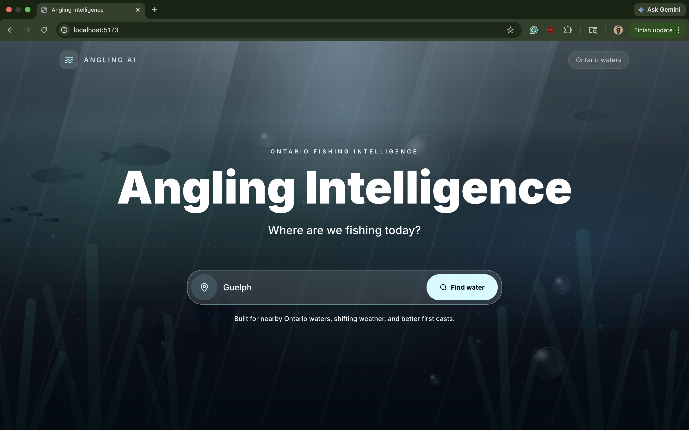
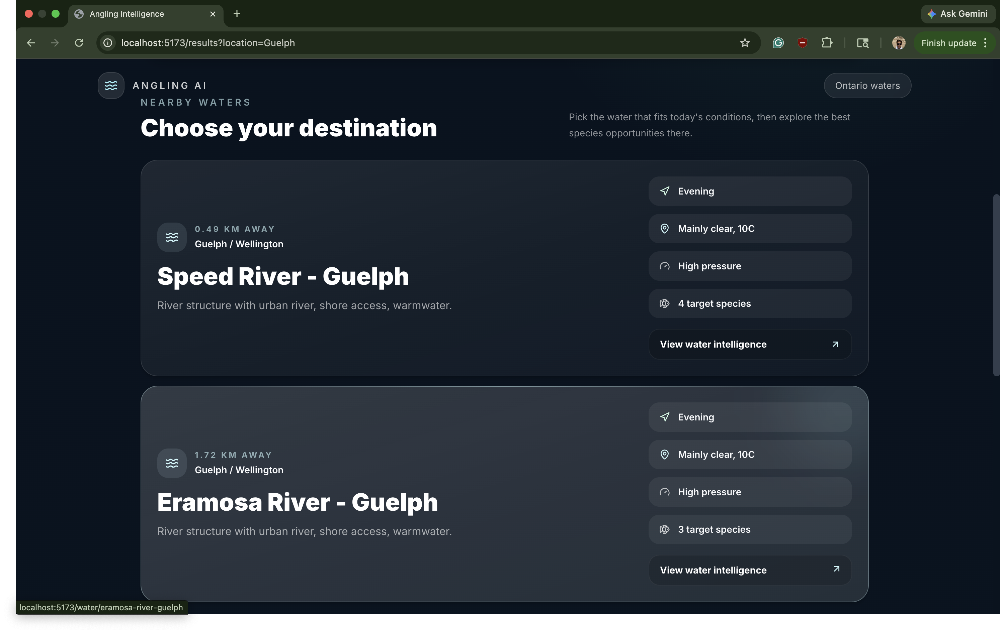
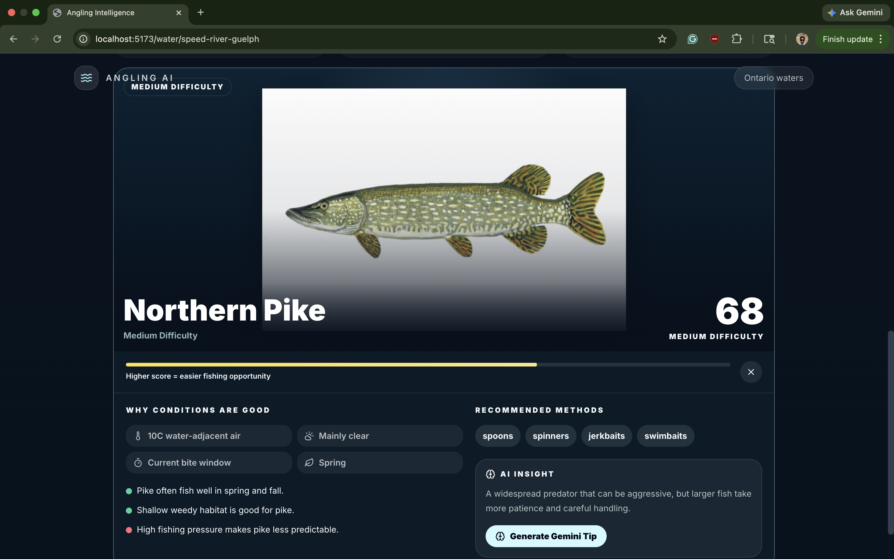
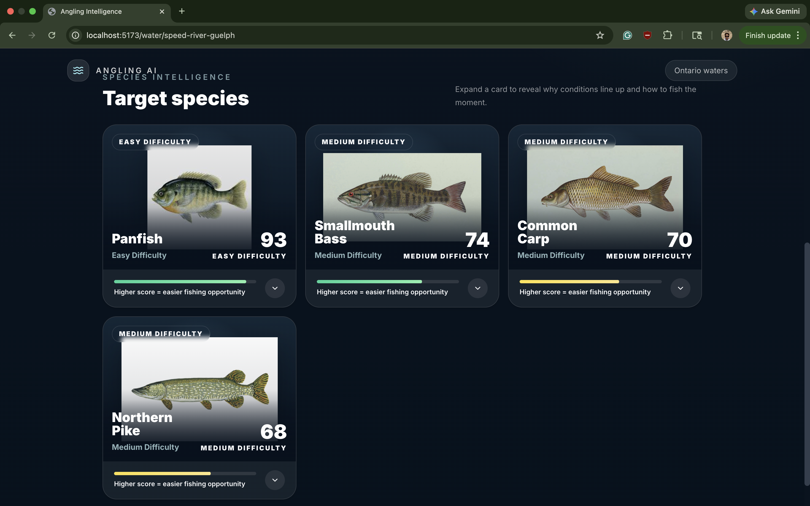
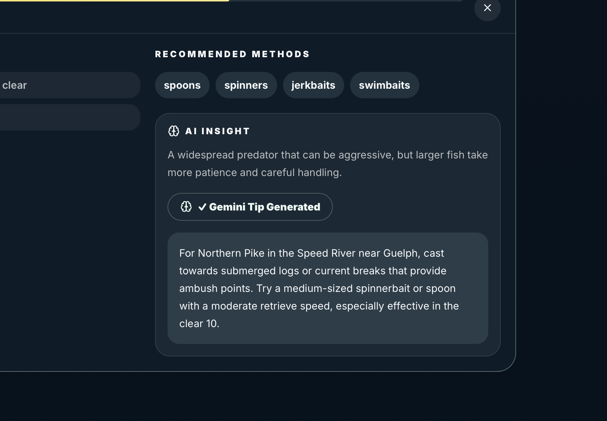

# Angling Intelligence

Angling Intelligence is a full stack web app for checking fishing conditions around Ontario. Users can search a location, find nearby lakes or rivers, check weather and environmental conditions, view species recommendations, and get fishing tips using Gemini.

## Key Features

- Search Ontario locations and find nearby fishing waters
- View water details such as distance, region, type, accessibility, and pressure
- Check current weather and environmental conditions
- Browse species-specific fishing recommendations
- Generate short fishing tips with the Gemini API
- Use fallback tips when no Gemini API key is available
- Work with a curated Ontario water and fish species dataset

## Technologies Used

**Frontend**

- React
- Vite
- JavaScript
- CSS

**Backend**

- Node.js
- Express
- Gemini API
- Weather/environmental APIs

## Screenshots











## My Contributions

- Worked on the overall full stack structure of the app
- Built React pages for searching, viewing results, and browsing water details
- Created Express API routes for location search, weather data, water data, and AI tips
- Helped build the recommendation logic for matching species with current conditions
- Integrated Gemini API support with a fallback response when an API key is not set
- Organized the Ontario water and fish species data used by the app

## Setup

```bash
git clone <repository-url>
cd Angling-Intelligence-Arya

cd backend
npm install

cd ../frontend
npm install
```

Create a `.env` file in `backend`:

```env
PORT=3000
GEMINI_API_KEY=your_gemini_api_key_here
```

`GEMINI_API_KEY` is optional. Without it, the app uses fallback fishing tips.

## Running Locally

Start the backend:

```bash
cd backend
npm run dev
```

Start the frontend in another terminal:

```bash
cd frontend
npm run dev
```

Frontend:

```txt
http://localhost:5173
```

Backend:

```txt
http://localhost:3000
```

## Project Context

This project started during a hackathon and was later cleaned up so the code, README, and overall flow better reflect the finished app.
